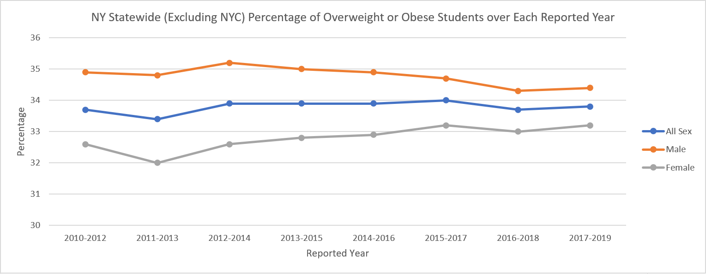

# Spreadsheet Analysis
## Dataset Details
The dataset used for analysis is [Student Weight Status Category Reporting Results: Beginning 2010](https://health.data.ny.gov/Health/Student-Weight-Status-Category-Reporting-Results-B/es3k-2aus), which is in CSV format.And some of the raw data looks like following:

| Location Code | County | Area Name | Region | Year Reported | Number Overweight | Percent Overweight | Number Obese | Percent Obese | Number Overweight or Obese | Percent Overweight or Obese | Grade Level | Number Healthy Weight | Percent Healthy Weight | Sex |
| --- | --- | --- | --- | --- | --- | --- | --- | --- | --- | --- | --- | --- | --- | --- |
| 0 | STATEWIDE (EXCLUDING NYC) | STATEWIDE (EXCLUDING NYC) | STATEWIDE (EXCLUDING NYC) | 2010-2012 | 77813 | 16.2 | 84578 | 17.6 | 162391 | 33.7 | DISTRICT TOTAL | 308259 | 0.641 | ALL |
| 0 | STATEWIDE (EXCLUDING NYC) | STATEWIDE (EXCLUDING NYC) | STATEWIDE (EXCLUDING NYC) | 2010-2012 | 38536 | 16.3 | 38261 | 16.2 | 76797 | 32.6 | DISTRICT TOTAL | 153898 | 0.653 | FEMALE |
| 0 | STATEWIDE (EXCLUDING NYC) | STATEWIDE (EXCLUDING NYC) | STATEWIDE (EXCLUDING NYC) | 2010-2012 | 39277 | 16 | 46317 | 18.9 | 85594 | 34.9 | DISTRICT TOTAL | 154361 | 0.629 | MALE |
| 0 | STATEWIDE (EXCLUDING NYC) | STATEWIDE (EXCLUDING NYC) | STATEWIDE (EXCLUDING NYC) | 2010-2012 | 44970 | 15.8 | 48843 | 17.2 | 93813 | 33 | ELEMENTARY | 184195 | 0.648 | ALL |
| 0 | STATEWIDE (EXCLUDING NYC) | STATEWIDE (EXCLUDING NYC) | STATEWIDE (EXCLUDING NYC) | 2010-2012 | 22092 | 15.9 | 22464 | 16.2 | 44556 | 32.2 | ELEMENTARY | 90927 | 0.656 | FEMALE |
| 0 | STATEWIDE (EXCLUDING NYC) | STATEWIDE (EXCLUDING NYC) | STATEWIDE (EXCLUDING NYC) | 2010-2012 | 22878 | 15.7 | 26379 | 18.1 | 49257 | 33.8 | ELEMENTARY | 93268 | 0.64 | MALE |
| 0 | STATEWIDE (EXCLUDING NYC) | STATEWIDE (EXCLUDING NYC) | STATEWIDE (EXCLUDING NYC) | 2010-2012 | 33004 | 16.8 | 35719 | 18.2 | 68723 | 35 | MIDDLE/HIGH | 124426 | 0.633 | ALL |
| 0 | STATEWIDE (EXCLUDING NYC) | STATEWIDE (EXCLUDING NYC) | STATEWIDE (EXCLUDING NYC) | 2010-2012 | 16387 | 16.9 | 15880 | 16.3 | 32267 | 33.2 | MIDDLE/HIGH | 63320 | 0.652 | FEMALE |
| 0 | STATEWIDE (EXCLUDING NYC) | STATEWIDE (EXCLUDING NYC) | STATEWIDE (EXCLUDING NYC) | 2010-2012 | 16617 | 16.7 | 19839 | 20 | 36456 | 36.7 | MIDDLE/HIGH | 61106 | 0.615 | MALE |

The data in the dataset are quite clean and organized; thus, I just add a column within the original csv using Python, which faetures an estimated number of students within each sample (represented by each row). This column of data is achieved from the number of healthy students divided by its percentage; moreover, the data will be calculated similarly with number of overweight or obese students and its percentage where the number of healthy students is missing or there are no healthy students in that sample. An essential part of the Python code which completes this addition is as following:
```
writer.writerow(next(reader) + ['Total (Estimated) Number of Students'])
for row in reader:
    if row[12] != '' and row[13] != '':
        new_value = round(int(row[12]) / float(row[13]))
    elif row[9] != '' and row[10] != '':
        new_value = round(int(row[9]) / float(row[10]) / 100)
    else:
        new_value = ''       
    row.append(new_value)
    writer.writerow(row)
```

Last, here are the links to [the original raw data](data/Student_Weight_Status_Category_Reporting_Results__Beginning_2010.csv), [the munged data](data/clean_data.csv), and [the spreadsheet file](data/analyzed_data.xlsx).

## Analysis
Description of the 8 aggreagte statistics in the spreadsheet:
- Average Percentage of Overweight: This statistic measures the average percentage of overweight students for all samples.
- Average Percentage of Obesity: This statistic measures the average percentage of obese students for all samples.
- Average Percentage of Healthy Weight: This statistic measures the average percentage of healthy-weight students for all samples.
- Average Number of Students in Each Sample: This statistic measures the average number of students for all samples.
- Average Percentage of Female Overweight or Obese Students Statewide (Excluding NYC) over Each Reported Year: This statistic measures the average percentage of female overweight or obese students in NY (excluding NYC) over each reported year, which demonstrates the overall percentage of female overweight or obese students within recent years. 
- Average Percentage of Male Overweight or Obese Students Statewide (Excluding NYC) over Each Reported Year: This statistic measures the average percentage of male overweight or obese students in NY (excluding NYC) over each reported year, which demonstrates the overall percentage of male overweight or obese students within recent years. And we can discover this value is larger than that of female students, showing that male students tend to have greater possibility to be overweight or obese.
- Average Percentage of Overweight or Obese Elementary Students Statewide (Excluding NYC) over Each Reported Year: This statistic measures the average percentage of overweight or obese elementary school students in NY (excluding NYC) over each reported year.
- Average Percentage of Overweight or Obese Middle/High Students Statewide (Excluding NYC) over Each Reported Year: This statistic measures the average percentage of overweight or obese middle/high school students in NY (excluding NYC) over each reported year. And by comparing such statistic with that of elementary school students, a greater portion of middle and high school students tend to be overweight or obese compared to elementary students.

Here's also a chart for visualization:

Description: This chart shows the change of percentage of overweight or obese male and female students respectively in NY state (excluding NYC) over reported years since 2010. We can observe that the percentage of overweight and obesity generally follows an increasing trend, indicating that more students tend to be overweight and obese every year regardless of gender. Thus, we need to pay more attention on this problem.

## Extra-credit
This assignment deserves extra credit because it tackles a large dataset with about 32 thousands row of data.