# Flask-MongoDB Web App

## Introduction

### Title
"Moments": an online social platform that allows users to post texts and pictures and react to each others' posts. Let's start with the home page.

## Home Page
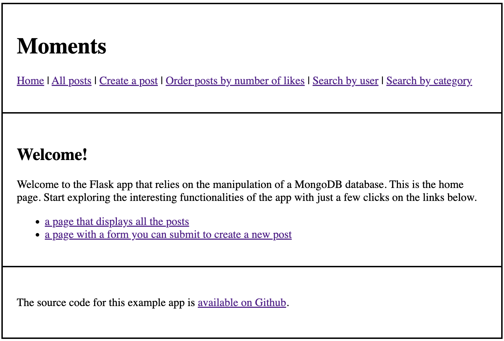

Let's click the "Create a post" link on the top of the page or the second link in the middle to create a new post.

## Create a new post
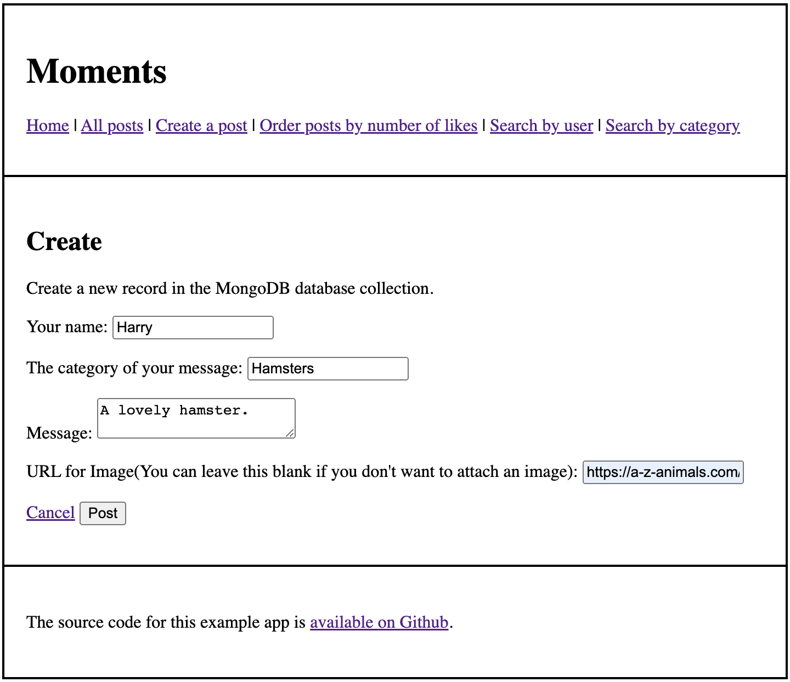

Creating posts by filling in the information and clicking the "Post" button navigates users to the page where all posts and comments are displayed.

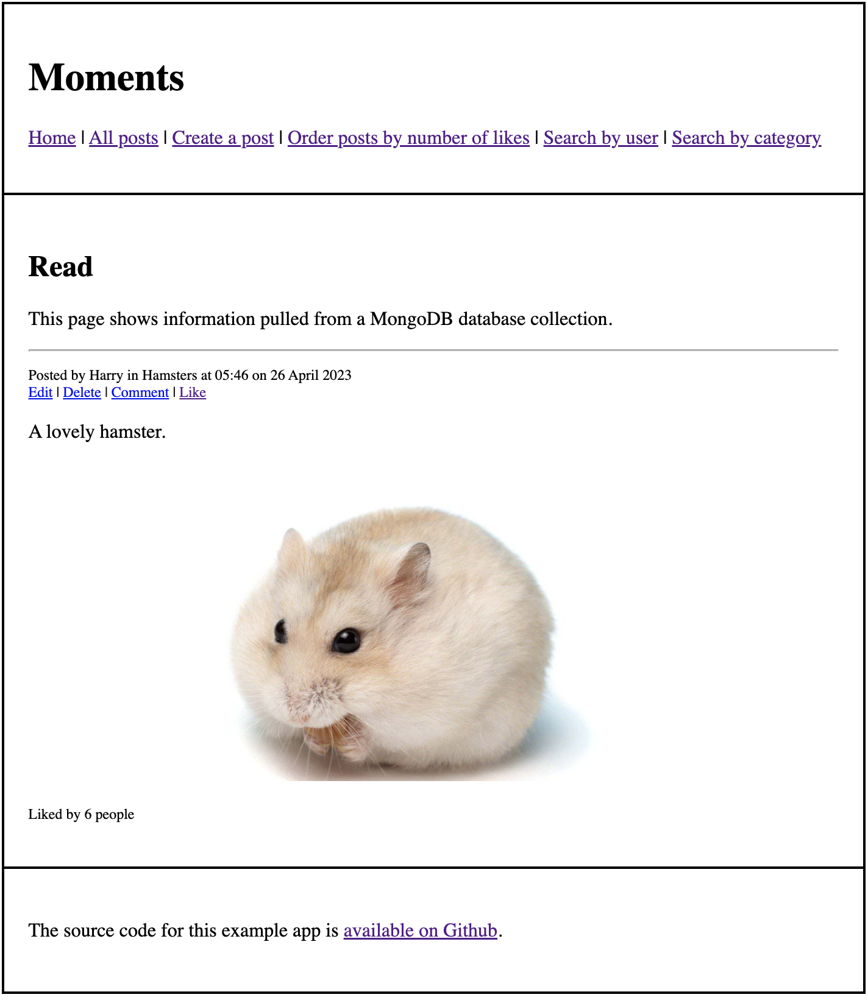

Hitting the like button each time increases the number of people who like the post by one.

## Create a new comment
Users can create comments regarding a post by clicking its "Comment" button.

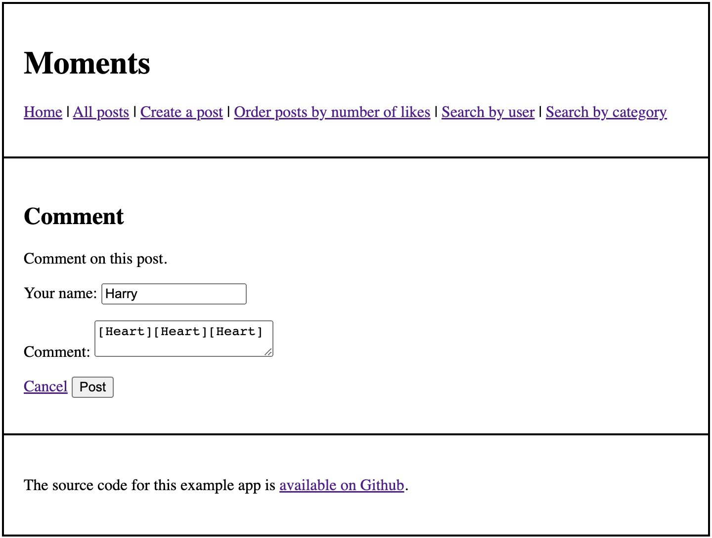

Clicking the "Post" button again navigates users to all the available posts. It is worth noting that a single post cannot have more than one corresponding comment and that repeating the commenting procedure when a comment has been created overwrites the existing comment.

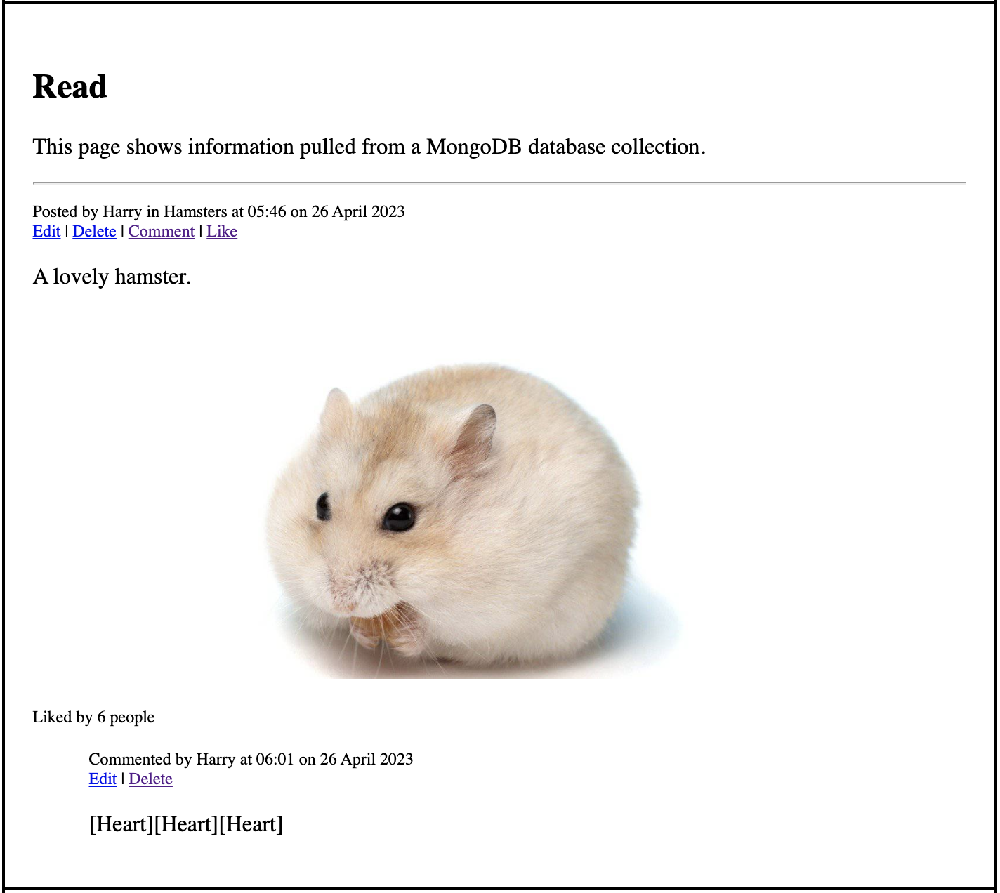

## Manage comments and posts

### Edit
Clicking the "Edit" button brings users to the update page and all the information appears in the blocks, which enables those who edit the posts to simply change the fields as they want.

### Delete
Simply clicking the "Delete" button removes the corresponding post or comment and deleting posts also removes corresponding comments.

## All posts

Let's look at a messy page with all the posts as shown. By default, the posts on the page are ordered from latest to oldest regardless of the comment.

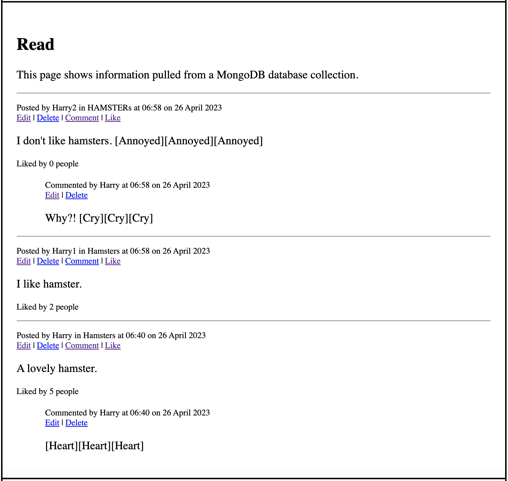

## Some functionalities

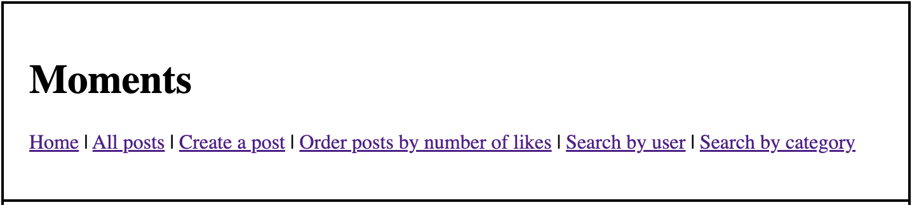

### Order posts by likes

Users can choose to order posts by the number of likes by clicking the corresponding button.

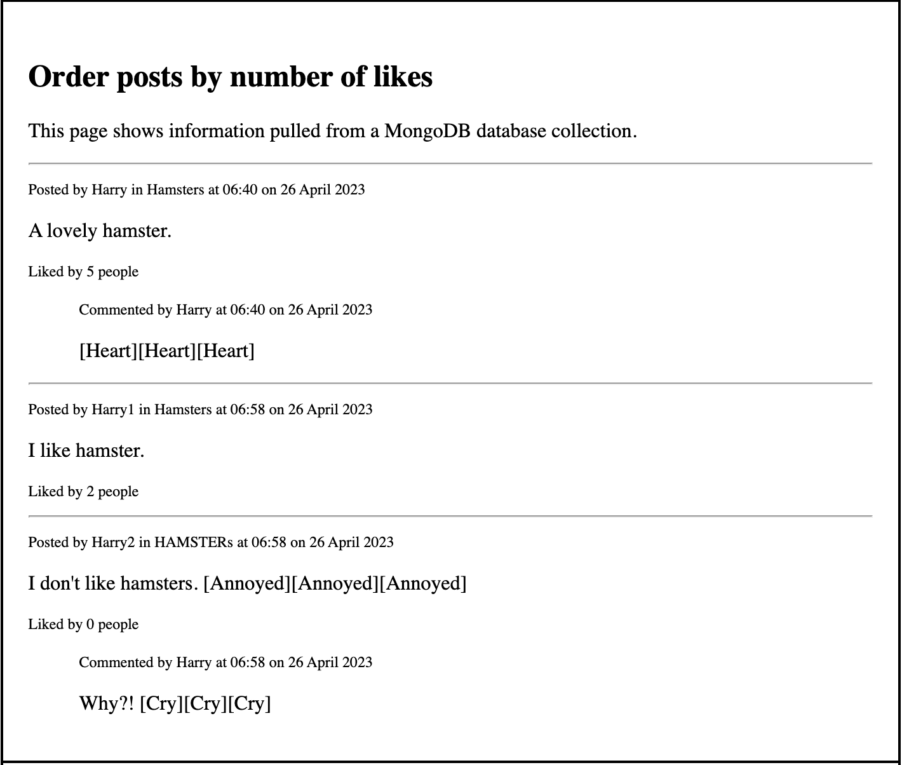

### Search

Users can search for either a user or a category. Note that the search functionality is case sensitive.

#### For a specific user

Suppose users are interested in everything posted by Harry. Users click the "Search by user" button and enter the following:

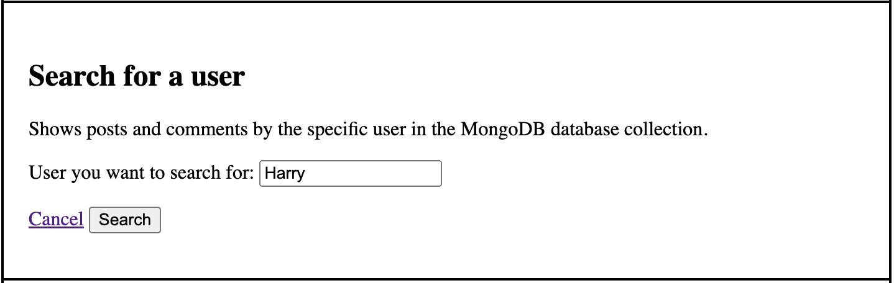

Hitting "Search" brings users to all the posts and comments that belong to that user without the attached posts or comments that belong to other users.

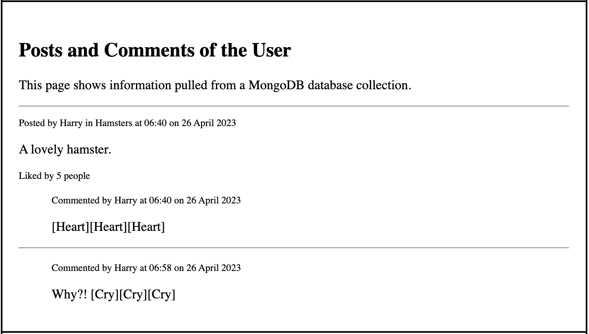

If users search for a nonexistent user as shown,

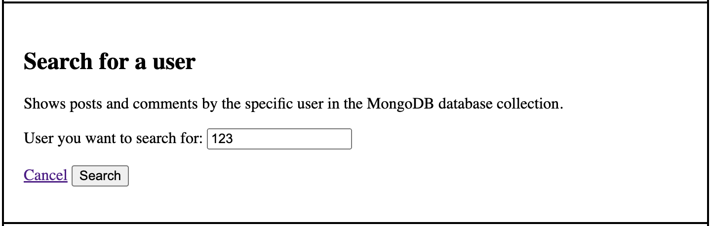

they get the following message instead.

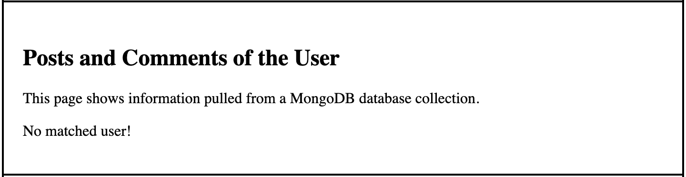

#### For a specific user

Similarly, suppose users are interested in everything in the category of "Hamster". They click the "Search by category" button and enter the following:

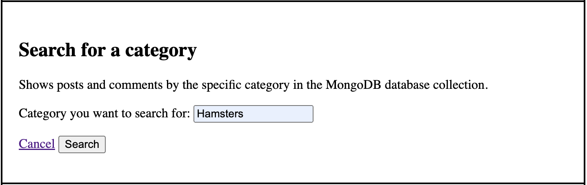

Hitting "Search" brings users to all the posts and comments (if exists) in that category.

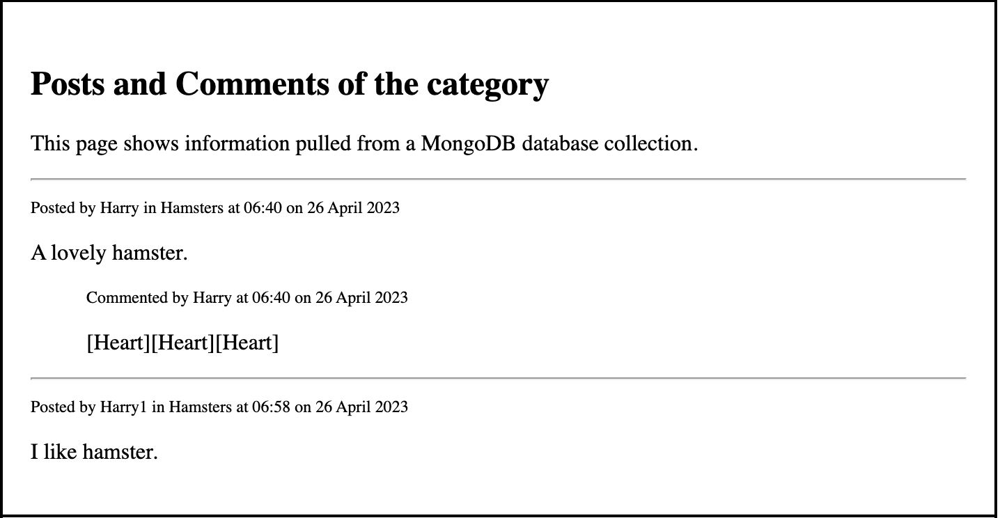

## A link to the deployed copy of the app
The link is [here](https://i6.cims.nyu.edu/~yr2071/web-app-ryqherry/flask.cgi/).

## Developers:
| Developer | full name  | NYU Net ID | link to Github account            |
|-----------|------------|------------|-----------------------------------|
| 1         | Yiqi Rao   | yr2071     | https://github.com/ryqherry       |
| 2         | Harry Shen | xs2029     | https://github.com/codingharry123 |

Thank you!